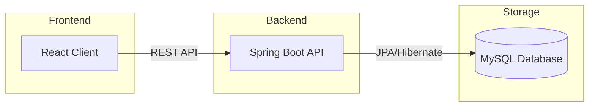

<div align="center">

  <h1>🚀 TaskFlow</h1>
  <p><strong>Modern Team Task Management & Collaboration Platform</strong></p>

  <p>
    
    
    
    
    
  </p>

  <h4>
    <a href="#-features">Features</a> •
    <a href="#-architecture">Architecture</a> •
    <a href="#-workflow">Workflow</a> •
    <a href="#-tech-stack">Tech Stack</a> •
    <a href="#-installation">Installation</a>
  </h4>

  <hr />
</div>

## 📄 Overview

**TaskFlow** is a production-ready, full-stack task management solution designed for modern teams. It bridges the gap between administrative oversight and member execution through a robust **Role-Based Access Control (RBAC)** system. Built with performance and security in mind, it leverages a high-performance Spring Boot backend and a lightning-fast React + Vite frontend.

---

## 🚀 Features

<table width="100%">
  <tr>
    <td width="50%" valign="top">
      <h4>🔐 Security & Auth</h4>
      <ul>
        <li>Secure Signup/Login flow</li>
        <li>Role-Based Access Control (ADMIN/MEMBER)</li>
        <li>Protected Frontend Routes</li>
        <li>DTO-based Backend Data Exposure</li>
      </ul>
    </td>
    <td width="50%" valign="top">
      <h4>📂 Management</h4>
      <ul>
        <li>Dynamic Project Creation (Admin)</li>
        <li>Real-time Task Assignment</li>
        <li>Status Tracking (Pending ➔ Completed)</li>
        <li>Automated User Discovery</li>
      </ul>
    </td>
  </tr>
  <tr>
    <td width="50%" valign="top">
      <h4>📊 Dashboards</h4>
      <ul>
        <li>Admin: Organizational Analytics</li>
        <li>Member: Personalized Task Board</li>
        <li>Real-time Data Synchronization</li>
        <li>Clean, Data-Driven Visuals</li>
      </ul>
    </td>
    <td width="50%" valign="top">
      <h4>💻 UI/UX</h4>
      <ul>
        <li>Modern Dark Sidebar / Light Workspace</li>
        <li>Responsive Mobile-first Design</li>
        <li>Micro-animations & Smooth Transitions</li>
        <li>Centralized API Interceptors</li>
      </ul>
    </td>
  </tr>
</table>

---

## 🏗 Architecture

The system follows a decoupled, **N-Tier Architecture** ensuring high scalability and maintainability.



---

## 🔄 Workflow

Experience a seamless operational flow designed for enterprise-level task delegation.

1. **Admin Creation** ➔ Create complex projects to group strategic objectives.
2. **Dynamic Discovery** ➔ Select from a live-synced list of organization members.
3. **Task Assignment** ➔ Delegate tasks with descriptions and target dates.
4. **Member Execution** ➔ Members receive tasks instantly on their secure dashboards.
5. **Real-time Sync** ➔ Status updates (Pending → In Progress → Completed) reflect globally.

---

## 🛠 Tech Stack

| Layer | Technologies |
| :--- | :--- |
| **Frontend** |     |
| **Backend** |    |
| **Database** |  |

---


## ⚙️ Installation

### 1. Prerequisites
* Java 17+
* Node.js 18+
* MySQL 8.0+

### 2. Backend Setup
```bash
cd backend
# Update application.properties with your DB credentials
./mvnw clean compile spring-boot:run
```

### 3. Frontend Setup
```bash
cd frontend
npm install
npm run dev
```

---

## 📊 Environment Configuration

Separate configuration profiles for clean development and production workflows.

#### Local Development (`application.properties`)
```properties
spring.datasource.url=jdbc:mysql://localhost:3306/taskmanager
spring.datasource.username=root
spring.datasource.password=YOUR_PASSWORD
spring.jpa.hibernate.ddl-auto=update
```

#### Production Template (`application-prod.properties`)
```properties
spring.datasource.url=jdbc:mysql://${DB_HOST}:3306/${DB_NAME}
spring.datasource.username=${DB_USER}
spring.datasource.password=${DB_PASS}
```

---

## 🎓 Learning Outcomes

* **Advanced RBAC**: Implementation of server-side role validation and frontend route guarding.
* **REST Data Integrity**: Leveraging DTOs and Service-layer branching for secure data exfiltration.
* **Entity Relationships**: Managing complex `@ManyToOne` associations in a relational schema.
- **Environment Management**: Decoupling configuration from code for production readiness.

---


